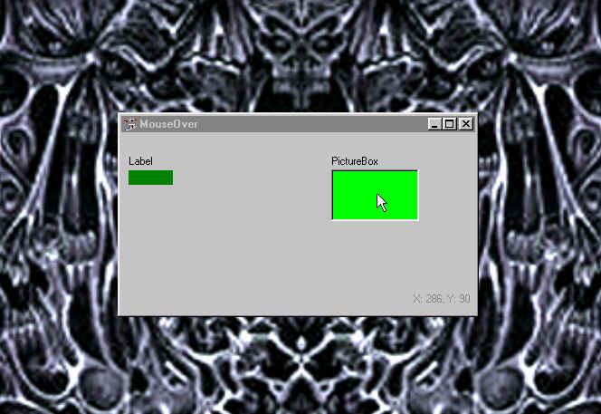



## A New Way For MouseOver Function That Works Correctly When You Move The MouseOut

### Description

Change the color of a control or the picture property or whaterver you need for that matter, And the control's property will return to it's original value when the mouse moves out. This Works!!!! Try It. Rate It.
 
### More Info
 

             |
---                |---
**Submitted On**   |2001-04-26 15:13:46
**By**             |[Jerrame Hertz](https://github.com/Planet-Source-Code/PSCIndex/blob/master/ByAuthor/jerrame-hertz.md)
**Level**          |Beginner
**User Rating**    |4.2 (21 globes from 5 users)
**Compatibility**  |VB 5\.0, VB 6\.0
**Category**       |[Miscellaneous](https://github.com/Planet-Source-Code/PSCIndex/blob/master/ByCategory/miscellaneous__1-1.md)
**World**          |[Visual Basic](https://github.com/Planet-Source-Code/PSCIndex/blob/master/ByWorld/visual-basic.md)
**Archive File**   |[A New Way 188464262001\.zip](https://github.com/Planet-Source-Code/jerrame-hertz-a-new-way-for-mouseover-function-that-works-correctly-when-you-move-the-mous__1-22719/archive/master.zip)

